# <span style='color: pink;'>**Installation Technique**</span>

## <span style='color: orange;'>**Création de la machine**</span>

- Tout d'abord rendez-vous sur virtualbox, cliquez sur Outils.


- Puis sur nouvelle,complétez-le avec les informations suivantes et remplacer par votre login : “prenom.nom.etu”

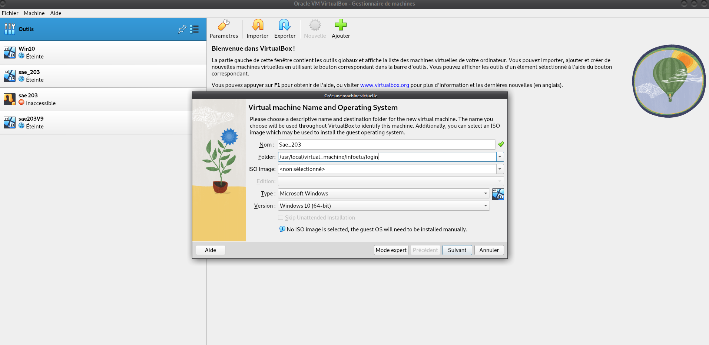

- Une fois cela fait allez dans le dossier de votre machine virtuelle, et dézipper votre dossier autoinstall_debian.zip comme ci-dessous :


- Ensuite,placez-vous dans le dossier autoinstall_Debian depuis votre terminal et tapez la commande suivante : “sed -i -E "s/(--iprt-iso-maker-file-marker-bourne-sh).*\$/\1=$(cat /proc/sys/kernel/random/uuid)/" S203-Debian12.viso”

- Une fois cela fait,placez l’iso Debian 12 dans la machine virtuelle(l’iso est présent dans le dossier autoinstall_Debian) comme i-dessous en appuyant sur “choose disk file”:

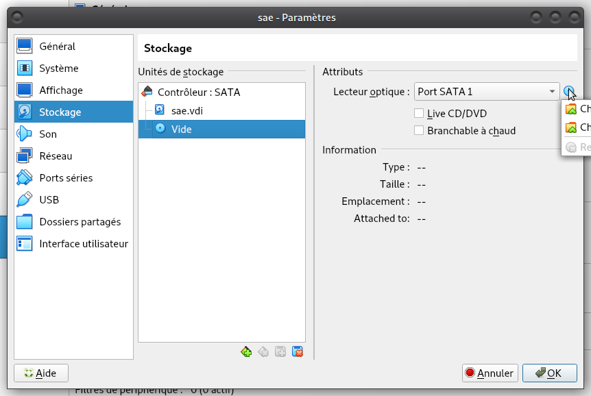

- Puis sur “ok” en bas à droite.

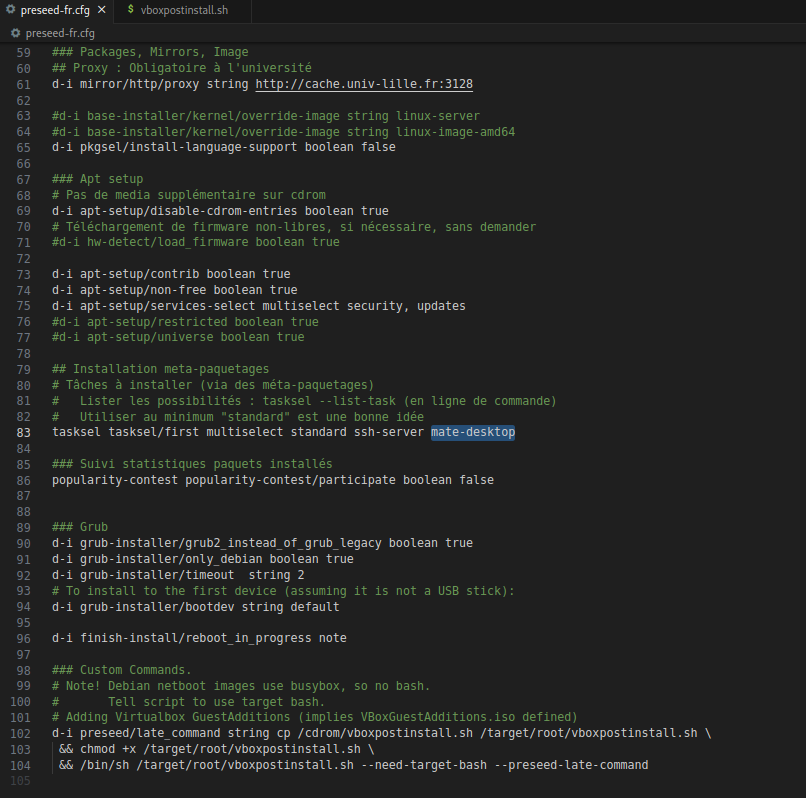

- Modifiez le fichier preseed-fr.cfg présent dans le autoinstall_Debian.zip afin d’installer Mate,une version graphique de Debian 12. Pour ce faire, ajoutez “mate-desktop” à la suite de la 83 ème ligne du fichier,comme le montre l’image ci-dessus.
Une fois cela fait,lancez votre machine virtuelle,si une erreur apparaît cela indique qu’une étape est ratée ou mal exécutée.
Le login et mot de passe sont “root” et en mot de passe “root”.

## <span style='color: orange;'>**Configuration de la situation géographique**</span>

 - Dans un premier temps nous avons configurer la machine afin de la mettre en français.


 - Dans un second nous configurons le fuseau horaire c'est dire le français.


 - Et enfin nous selectionnons le clavier que nous voulons encore une fois le français.

 

## <span style='color: orange;'>**Configuration du réseau**</span>

- Vu que nous souhaitont créer un serveur nous allons nommer la machine server.

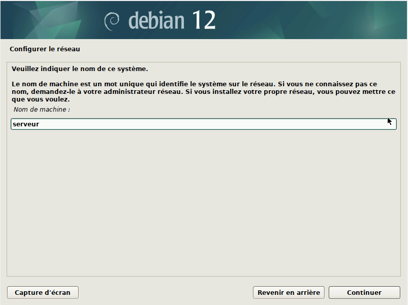

- Et nous laissons le domaine vierge.

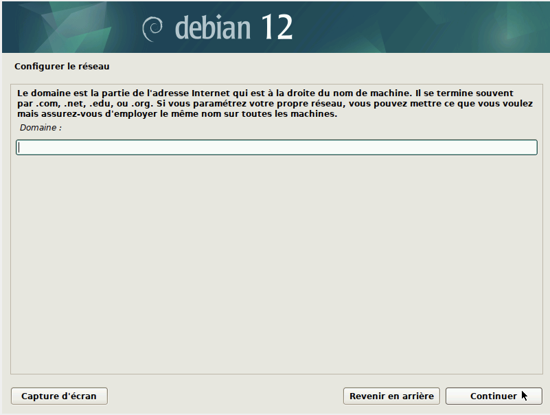

## <span style='color: orange;'>**Création et configuration des comptes**</span>

- Vu que nous souhaitons créer un compte root ayant pour mot de passe "root", nous marquons "root" puis le comfirons en l'écrivant de nouveau.

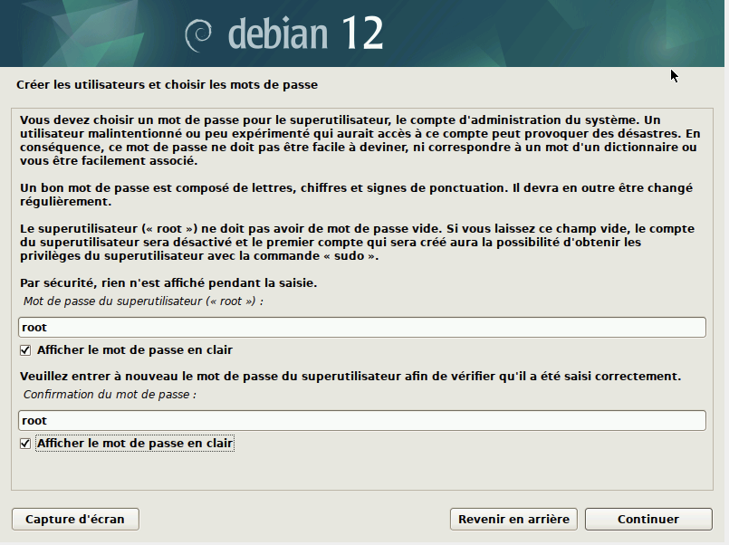

- et vu que nous voulons aussi créer un compte user se nommant "user" nous l'appelons user, et nous lui mettons le mot de passer user.


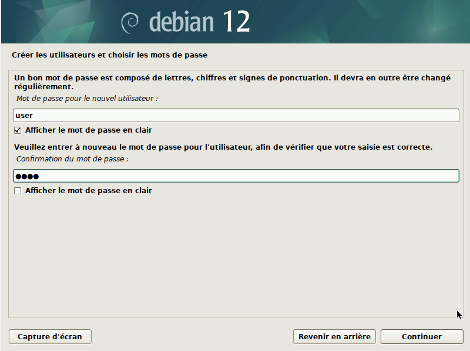

## <span style='color: orange;'>**Partitionnement de l'espace de stockage**</span>

- Vu que nous voulons pas nous compliquer la vie, nous selectionnant le mode "assisté - utiliser un disque entier" puis nous sélectionnant le disque et enfin nous mettons tout dans une seul partition, nous validons et appliquons les modifications.


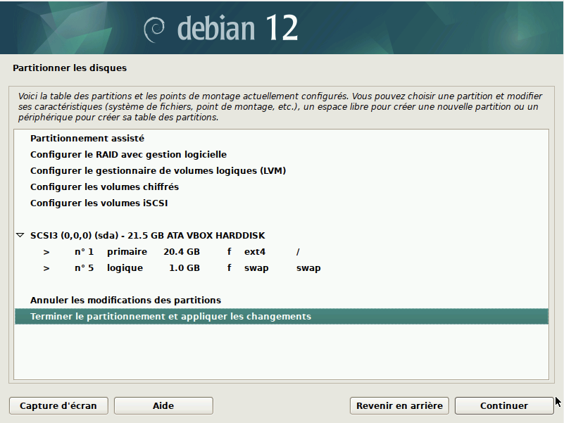

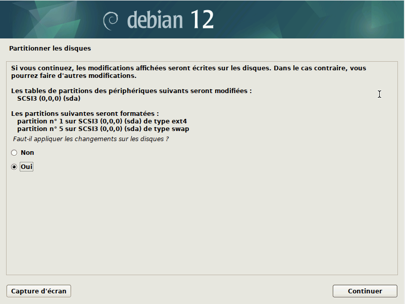

## <span style='color: orange;'>**Configuration de l'outil de gestion des paquets**</span>

- Tout d'abord nous refusant l'analyse des autres supports d'installation.

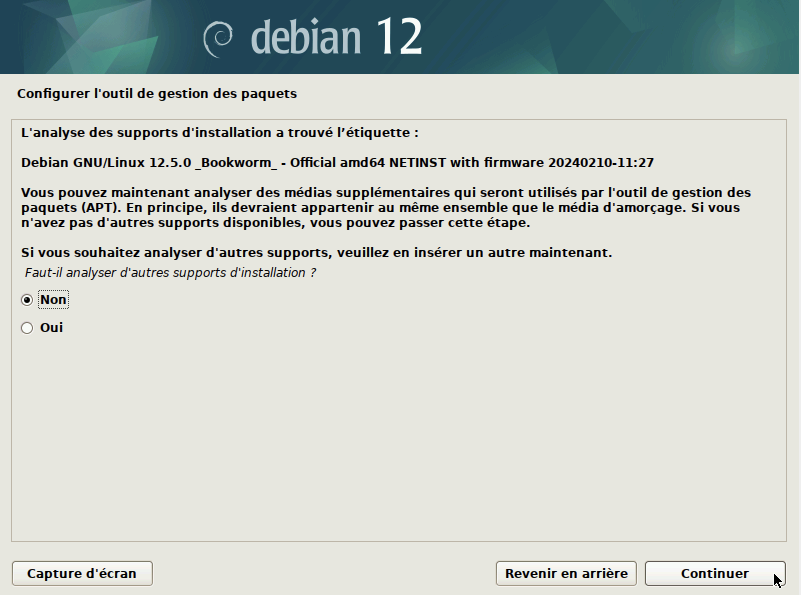

- Puis nous selectionnons la france comme pays pour le miroir de l'archive Debian.


- Et enfin le miroir "debian.polytech-lille.fr".


## <span style='color: orange;'>**Selection des logiciels**</span>

- Pour les différents logiciel à installer nous installons"environnement de bureau Debian" car c'est mieu d'avoir un bureau niveau visuel, "_MATE_" car celui nous ait imposé, "serveur web" car correspond à notre besoin de faire un serveur, "serveur _SSH_ car lui aussi correspond à notre besoin de faire un serveur" et "utilitaires usuels du système" pour avoir logiciel basic mais toujours pratique.


- Ensuite nous refusons d'installer le programme _GRUB_ sur le disque principal.

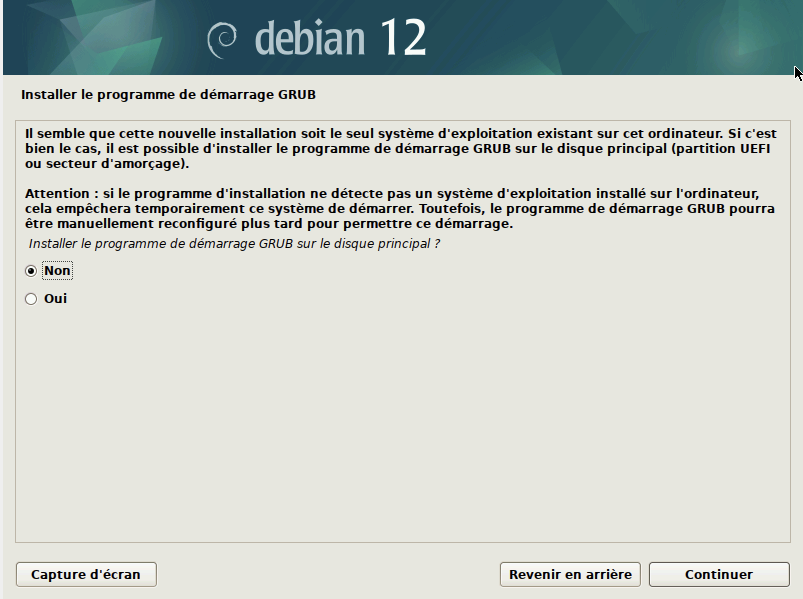

## <span style='color: orange;'>**Commande à faire depuis la machine**</span>

Dans le cas ou une demande du type [0/n] se propose, répondez “o” oui “0”, c’est une confirmation.

|Commande                       |Fonction                                             |
|:----------------------------- |----------------------------------------------------:|
|sudo apt update                |Met à jour “apt”                                     |
|apt install git-all            |Installe toutes les configurations et fichiers de git|
|apt install sudo               |Installe la fonction de “sudo”                       |
|apt install neofetch           |Installe Neofetch                                    |
|apt-get install sqlite3        |Installe SQLite3                                     |
|apt-get install curl           |Installe Curl                                        |
|apt-get install bash-completion|Installe Bash-completion                             |
|sudo usermod -aG sudo user     |Donne les droits sudo à l’utilisateur                |

## <span style='color: orange;'>**Installation de Gitea**</span>

### <span style='color: green;'> **Quelque informations sur GITEA**</span>

- Qu'est ce que GITEA ?

    GITEA est un logiciel de gestion de versions _GIT_.

- A quoi peut t-on comparer GITEA ?

    GITEA est comparable à GITHUB ou encore GITLAB.

### <span style='color: green;'> **Comment l'installer ?**</span>

- Dans un premier nous allons faire la commande ci-dessous affin de faire un nouvel utilisateur git ainsi qu'un groupe git: 
"adduser --system --group --disabled-password --shell /bin/bash --home /home/git --gecos 'Git Version Control' git".
                
- puis pour être d'avoir la bonne version de wget.

```apt install wget```

- puis pour pouvoir les fichier gitea vers "/usr/local/bin.

```sudo mv /tmp/gitea /usr/local/bin```

- puis pour installer GITEA.

```wget -O /tmp/gitea https://dl.gitea.io/gitea/1.15.3/gitea-1.15.3-linux-amd64```.

- et enfin les commandes suivantes:

```
sudo mv /tmp/gitea /usr/local/bin
chmod +x /usr/local/bin/gitea
mkdir -p /var/lib/gitea/{custom,data,indexers,public,log}
chown git: /var/lib/gitea/{data,indexers,log}
chmod 750 /var/lib/gitea/{data,indexers,log}
mkdir /etc/gitea
chown root:git /etc/gitea
vchmod 770 /etc/gitea
wget https://raw.githubusercontent.com/go-gitea/gitea/master/contrib/systemd/gitea.service -P /etc/systemd/system
systemctl daemon-reload
systemctl enable --now gitea
sudo mv /tmp/gitea /usr/local/bin
chmod +x /usr/local/bin/gitea
mkdir -p /var/lib/gitea/{custom,data,indexers,public,log}
chown git: /var/lib/gitea/{data,indexers,log}
chmod 750 /var/lib/gitea/{data,indexers,log}
mkdir /etc/gitea
chown root:git /etc/gitea
vchmod 770 /etc/gitea
wget https://raw.githubusercontent.com/go-gitea/gitea/master/contrib/systemd/gitea.service -P /etc/systemd/system
systemctl daemon-reload
systemctl enable --now gitea
```
### <span style='color: green;'> **Partie avec affiche visuel**</span>

- maintenant vous allez aller sur : http://localhost:3000/

- Vous y choisirez SQLite3 pour le type de base de données.

- Et en chemin vous prendrez un chemin absolut menant vers "/var/lib/gitea/data/gitea.db"

# <span style='color: pink;'>**Les questions de vocabulaire et de culture informatique**</span>
## <span style='color: orange;'>**Les questions de vocabulaire**</span>
- Que signifie “64-bit” dans “Debian 64-bit” ?

    Les 64 bits correspondent à la façon dont le processeur d'un
    ordinateur (également appelé _CPU_) gère les informations.

- Quelle est la configuration réseau utilisée par défaut ?

    127.0.0.1/8

- Quel est le nom du fichier _XML_ contenant la configuration de votre machine ?

    Le fichier est :Sae_203.vbox-prev

- Sauriez-vous le modifier directement ce fichier de configuration pour mettre 2 processeurs à votre machine ?

    Oui en modifiant le code suivant : \<CPU count="1"/> en \<CPU count="2"/>

- Qu’est-ce qu’un fichier iso bootable ?

    En effet un fichier ISO est juste un fichier image créé à partir d'un _CD_
    ou d'un _DVD_ (des logiciels, des jeux, etc.). Vous pouvez donc
    transformer votre clé _USB_ pour qu'elle se comporte en _CD_ ou _DVD_. Le
    seul moment où elle a besoin d'être bootable c'est si vous mettez l'_ISO_
    d'un système d'exploitation dessus.
- Qu’est-ce que _MATE_ ? _GNOME_ ?

    MATE (prononcer maté à l'espagnole) est un environnement de bureau
    libre utilisant (dans un premier temps) la boîte à outils GTK+ 3.x et
    destiné aux systèmes d'exploitation apparentés à _UNIX_.
    Il consiste en un fork de _GNOME_ et son nom vient du yerba maté dont
    les feuilles sont utilisées pour préparer une boisson stimulante en
    Amérique latine 3 .
- Qu’est-ce qu’un serveur web ?

    Un « serveur web » peut faire référence à des composants logiciels
    (software) ou à des composants matériels (hardware) ou à des
    composants logiciels et matériels qui fonctionnent ensemble.
    - Au niveau des composants matériels, un serveur web est un
    ordinateur qui stocke les fichiers qui composent un site web (par
    exemple les documents HTML, les images, les feuilles de style
    CSS, les fichiers JavaScript) et qui les envoie à l'appareil de
    l'utilisateur qui visite le site. Cet ordinateur est connecté à Internet
    et est généralement accessible via un nom de domaine tel que
    mozilla.org.
    - Au niveau des composants logiciels, un serveur web contient
    différents fragments qui contrôlent la façon dont les utilisateurs
    peuvent accéder aux fichiers hébergés. On trouvera au minimum
    un serveur _HTTP_. Un serveur _HTTP_ est un logiciel qui comprend
    les URL et le protocole _HTTP_ (le protocole utilisé par le navigateur
    pour afficher les pages web).
- Qu’est-ce qu’un serveur _SSH_ ?

    SSH, ou Secure Socket Shell, est un protocole réseau qui permet aux
    administrateurs d'accéder à distance à un ordinateur, en toute
    sécurité. SSH désigne également l'ensemble des utilitaires qui mettent
    en œuvre le protocole.
- Qu’est-ce qu’un serveur mandataire ?

    Un serveur mandataire ou proxy (de l'anglais) est un serveur
    informatique qui a pour fonction de relayer des requêtes entre un poste
    client et un serveur. Les serveurs mandataires sont notamment utilisés
    pour assurer les fonctions suivantes :
    - mémoire cache ;
    - la journalisation des requêtes (" logging ") ;
    - la sécurité du réseau local ;
    - le filtrage et l'anonymat.
    
    L'utilité des serveurs mandataires est importante, notamment dans le
    cadre de la sécurisation des systèmes d'information
    pour ces questions, vous devrez trouver les réponses dans la
    documentation officielle et nous

- À quoi servent les suppléments invités ? Donner 2 principales raisons de les installer.

    Elles permettent : D'améliorer l'affichage graphique. De partager le presse-papier entre la machine virtuelle et la machine hôte. La possibilité de partager des répertoires entre la machine virtuelle et la machine hôte.

- À quoi sert la commande mount (dans notre cas de figure et dans le cas général)
 
    La commande mount permet de demander au système d'exploitation de rendre un système de fichiers accessible, à un emplacement spécifié (le point de montage). La commande mount monte un système de fichiers indiqué comme répertoire à l'aide du paramètre Noeud:Répertoire, sur le répertoire spécifié par le paramètre Répertoire. Une fois la commande mount exécutée, le répertoire indiqué devient le répertoire racine du nouveau système de fichiers monté.
    Si vous entrez la commande mount sans option, elle affiche les informations suivantes sur les systèmes de fichiers montés :
    - le noeud (si le montage est éloigné) 
    - l'objet monté
    - le point de montage
    - le type de système de fichiers virtuel
    - l'horodatage du montage
    - toute option de montage

    Vous pouvez utiliser le répertoire /mnt comme point de montage local ou vous pouvez créer un répertoire à l'aide de la commande mkdir. Tout répertoire créé à l'aide de la commande mkdir doit être un sous-répertoire de votre répertoire d'accueil.

- Quel est la version du noyau Linux utilisé par votre VM ? N’oubliez pas, comme pour toutes les questions, de justifier votre réponse.

    Debian 12 version la plus simple à trouver de par le fait que lien de téléchargement sur la page principal de debian télécharge la version 12.

## <span style='color: orange;'>**Les questions sur Debian**</span>

- 1.Qu’est-ce que le Projet Debian ? D’où vient le nom Debian ?


    La maintenance
    Le projet Debian est un groupe mondial de volontaires qui s'efforcent de
    produire un système d'exploitation qui soit composé exclusivement de
    logiciels libres. Le principal produit de ce projet est la distribution Debian
    GNU/Linux, qui inclut le noyau Linux ainsi que des milliers d'applications
    pré empaquetées. Divers types de processeurs sont gérés à des degrés
    divers, en incluant les architectures x86 32 ou 64 bits, ARM, MIPS,
    PowerPC et IBM S/390. Le nom Debian est issu des prénoms du
    créateur de cette distribution GNU Linux Ian Murdock et de son
    épouse Debra.

    https://fr.wikipedia.org/wiki/Debian

- 2.Il existe 3 durées de prise en charge (support) de ces versions :
la durée minimale, la durée en support long terme (_LTS_) et la durée en support long terme étendue (_ELTS_). Quelle sont les durées de ces prises en charge ?

     |version de prise en charge | durée|
     | :---------------------    | ----:|
     |_LTS_                        | 2 ans|
     |_Standard_                   | 5 ans|
     |_ELTS_                       | 5 ans|

    https://wiki.debian.org/fr/LTS

- 3.Pendant combien de temps les mises à jour de sécurité seront-elles
fournies ?


    Elles sont fait trois années après la publication.

- 4.Combien de versions au minimum sont activement maintenues par
Debian ? Donnez leur nom générique (= les types de distribution).


    3 versions

    - STABLE
    - TESTING
    - UNSTABLE

    https://wiki.debian.org/fr/LTS

- 5.Chaque distribution majeur possède un nom de code différent. Par exemple, la version majeur actuelle (Debian 12) se nomme bookworm. D’où viennent 


    Les différents noms proviennent des noms des jouets de la saga TOY
    STORY.

    https://en.wikipedia.org/wiki

- 6.L’un des atouts de Debian fut le nombre d’architecture (≈processeurs) officiellement prises en charge. Combien et lesquelles sont prises en charge par la version Bullseye ?


    Il y a 9 architecture pris en charge par la version Bullseye:
    - amd64 pour les PC AMD64 64 bits / Intel EM64T / x86-64.
    - i386 pour les PC i386 32 bits / Intel IA-32.
    - ppc64el pour PowerPC 64 bits little-endian Motorola/IBM PowerPC.
    - s390x pour les serveurs IBM S/390 64 bits.
    - armel pour ARM.-armhf pour les anciens matériels ARM et les architectures 32 bits plus
    récentes.
    - arm64 pour les architectures ARM 64 bits Arch64.
    - mipsel pour MIPS 32 bits little-endian.
    - mips64el pour MIPS 64 bits little-endian.

    https://www.debian.org/releases/bullseye/arm64/release-notes/ch-whats-new.fr.html#idm120

- 7.Première version avec un nom de code
    - Quelle a était le premier nom de code utilisé ?
    - Quand a-t-il été annoncé ?
    - Quelle était le numéro de version de cette distribution ?

    

        - Buzz
        - 19 août 1991
        - 0.99.14

- 8.Dernière nom de code attribué
    - Quel est le dernier nom de code annoncée à ce jour ?
    - Quand a-t-il été annoncé ?
    - Quelle est la version de cette distribution ?

- Bookworm
- 23 avril 2022
- La version 12

## <span style='color: orange;'>**Question sur _GIT_**</span>

- Qu’est-ce que le logiciel gitk ? Comment se lance-t-il ?

Gitk est un navigateur de dépôt graphique, le premier de son genre. Il peut être considéré comme un encapsuleur graphique pour git log . Il permet d'explorer et de visualiser l'historique d'un dépôt. Gitk se lance en effectuant la commande suivante “gitk &”, il sera affecté au dossier dans lequel vous l’utilisez.

- Qu’est-ce que le logiciel git-gui ? Comment se lance-t-il ?

Git GUI. C'est un des outils de base fourni avec Git lors de son installation. Il va vous permettre entre autre de voir le diff des modifications en cours dans votre workspace ou encore de faire des commits et des pushs et bien plus encore.Pour lancer git-gui, effectuez la commande suivante “git citool”.

## <span style='color: orange;'>**Les questions sur GITEA **</span>

- La version utilisé de GITEA peut être grâce à la commande :

    ```VERSION=<THE_LATEST_GITEA_VERSION>```

- Pour pouvoir mettre à jour le binaire du service sans devoir tout reconfigurer il faut utiliser la commande :

    ```wget -O /tmp/gitea https://dl.gitea.io/gitea/${VERSION}/gitea-${VERSION}-linux-amd6```

        cependant la version 1.22-dev n'existe pas

# <span style='color: pink;'>**Les difficultés rencontrés**</span>

Le majeur problème que nous avons renconté est la gestion du temps ainsi l'automatisation de la machine virtuelle ainsi que l'installation de Gitea.
